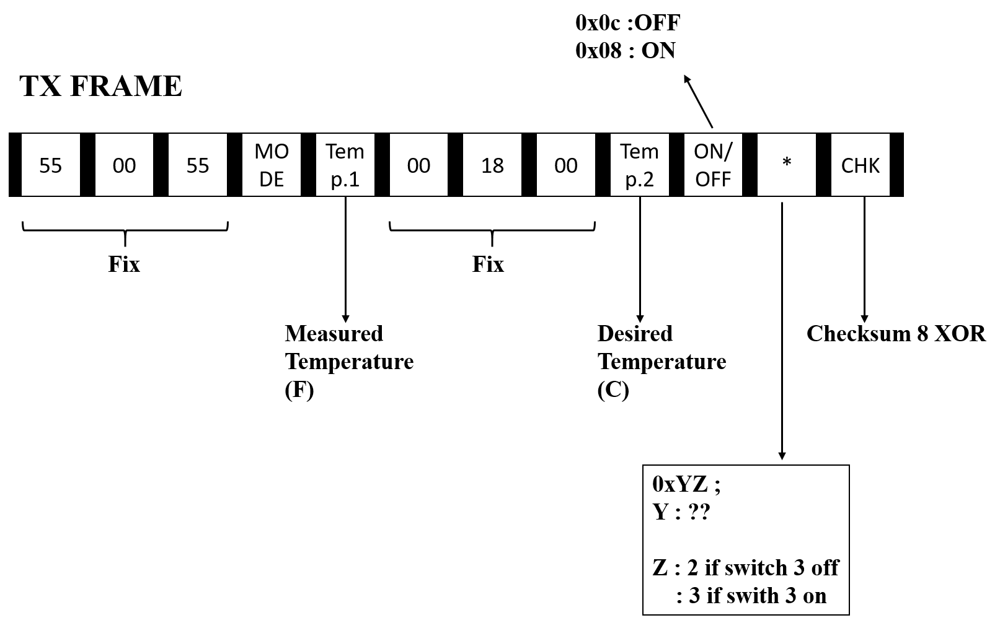
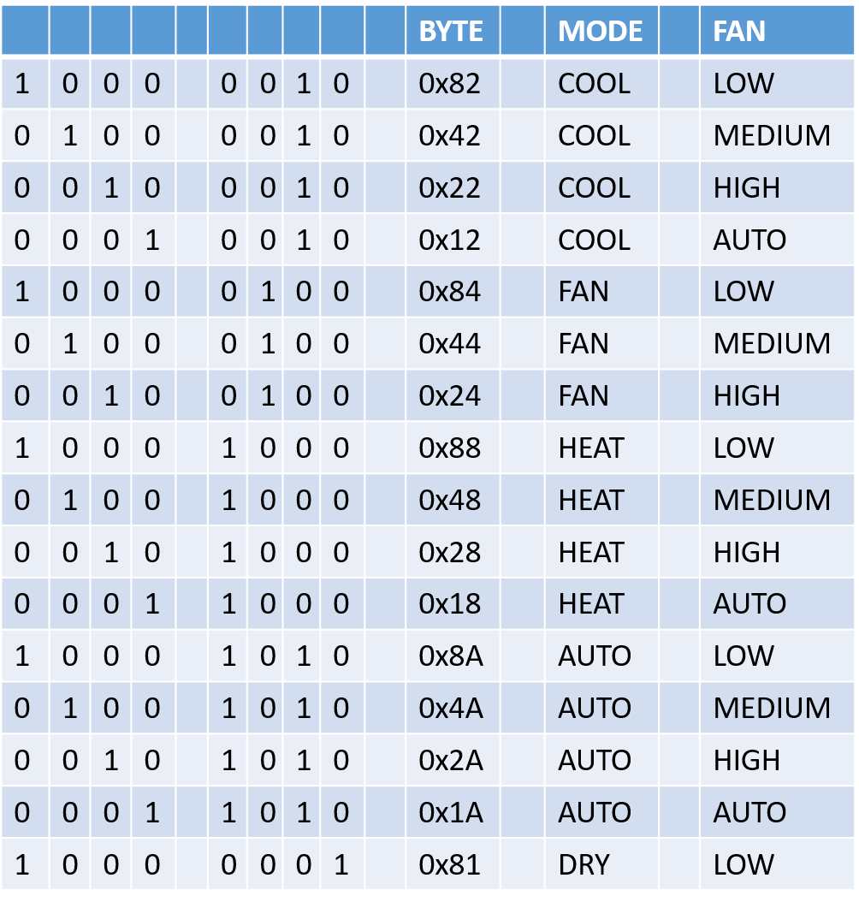
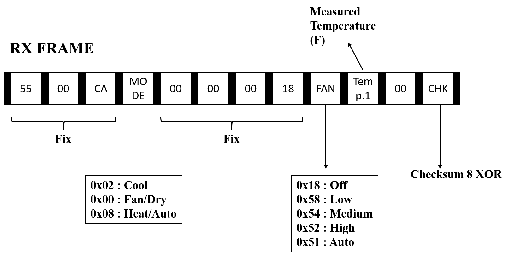

## Experience 
     *The communication between the A/C and the Esp32 is provided by the TTL protocol, not the RS485 protocol.
     *While the RX signal from the air conditioner can directly read the TX signal needs to be sent inversion.
     *ON TX signal :
        - 1., 2., 3., 6., 7. and 8.Byte is fixed.
        - 4.Byte : The first 4 bits of 4.Byte indicate the fan speed of the A/C and the last 4 bits indicate the Mode of the A/C.
        - 5.Byte : Displays the measured temperature (° F).
        - 9.Byte : The desired temperature (° C), respectively.
        - 10.Byte: ON/OFF indicates the status.
        - 11.Byte: The first 4 bits indicate the error code and the last 4 bits indicate deepswicth.
        - 12.Byte: Checksum 8-bit XOR is the frame used for error detection.

###### Figure 1: TX Frame

###### Figure 2: AC mods
     *ON RX signal :
        - 1., 2., 3.,5., 6., 7. ve 8.Byte is fixed.
        - 4.Byte : Indicates the mode of the A/C.
        - 9.Byte : Indicates the fan speed of the air conditioner.
        - 10.Byte: Shows the measured temperature (° F).
        - 11.Byte: Checksum 8-bit XOR is the frame used for error detection.

###### Figure 3: RX Frame
    *The air conditioner communicates with 115200 Baud Rate and Serial 8 bit even parity.
    *For Mqtt connection, firstly, Wifi connection should be observed to be error free.
    *The communication line with Mqtt should be listened continuously and operations should be started when the desired data is received.
    *In case of error occurrence, the WatchDog timer was used instead of developing the algorithm using EEPROM.
