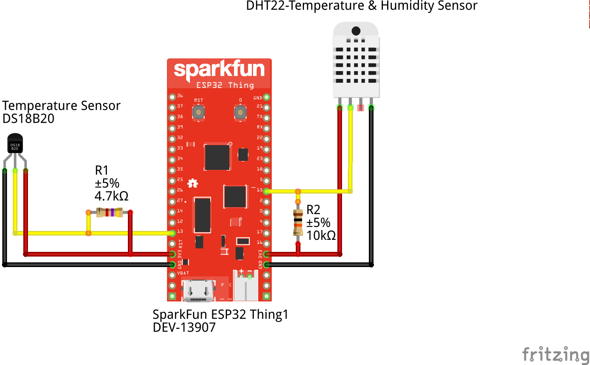
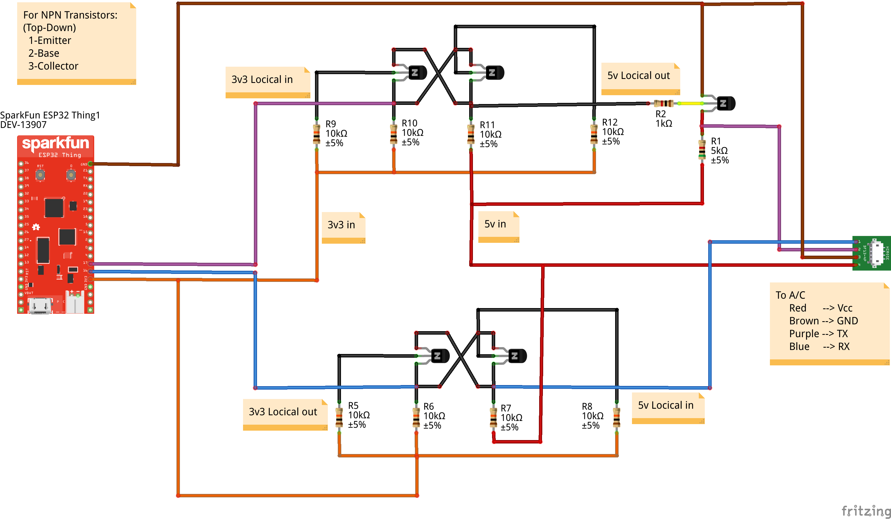
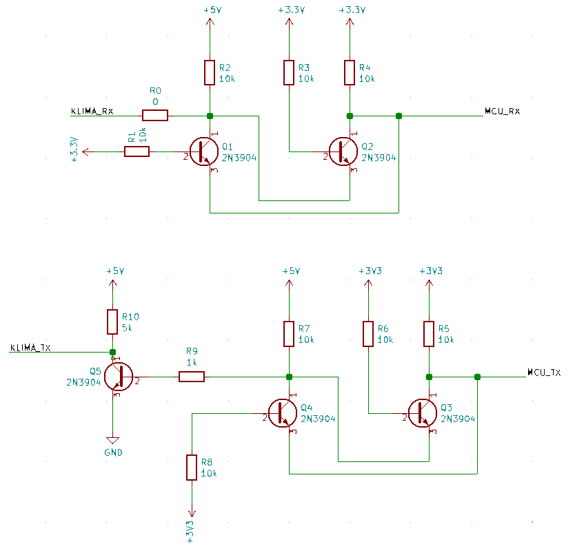
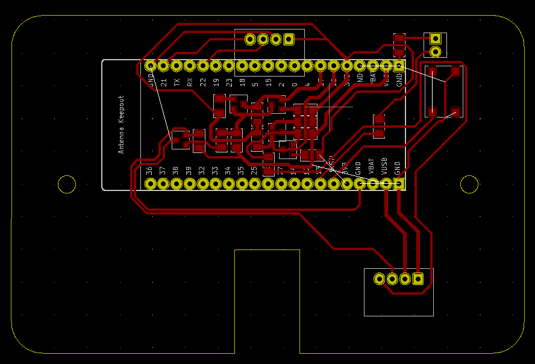
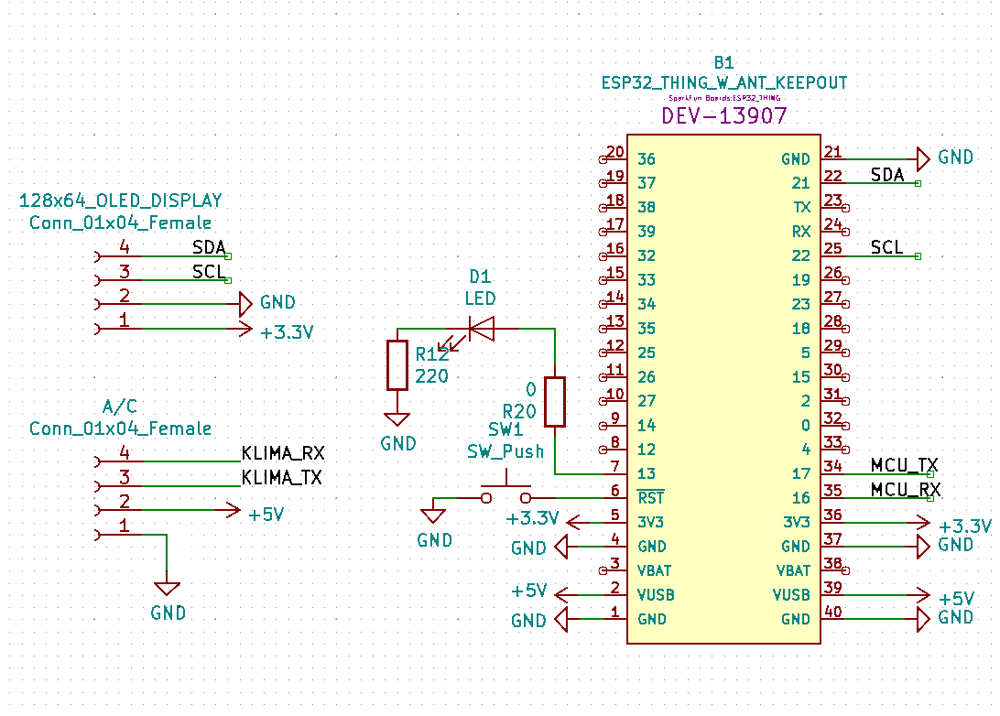

## Controller Unit
TODO: write a brief description (input, output, function of the subsystem, deployment method, etc...)

### Table of Contents
	* Decription
	* System Overview
	* Components Used
	* A-Star Sensor
	* PCB Circuit
	* Inputs And Outputs

### Description
In this part of the project:

	* Data will be taken from air conditioner (Airwell) and sensors(A-star sensors)
	* The read data will be saved to the database
	* Air conditioning settings will be set according to the data from the web application
	
### System Overview
TODO: Add Figure & Explain !!

### Components Used
	* Raspberry pi 3 B +
	* A-Star Sensors
	* Sparkfun ESP32 Thing
	
	
### A-Star Sensor
This sensor consist of 4 component:

	1 - Sparkfun ESP32 Thing
	2 - DS18B20 Temperature Sensor
	3 - DHT22 Temperature and Humidity Sensor
	4 - 3.7V LiPo Battery 

The connection between Sparkfun ESP32 Thing and DS18B20 Temperature Sensor is given below.

###### Figure 1: Circuit Connection

### Circuit Connection between A/C and ESP32

###### Figure 2: Circuit Connection 

### PCB Circuit

In our project, Sparkfun ESP32 Thing is used to control air conditioners. The A/C communicates with a 5v logic signal, but Sparkfun ESP32 Thing uses a 3.3v logic signal. Therefore, a level-shifter circuit's are needed between these two. In addition, during our studies it was found that the TX signal was inverted and sent to the A/C. Therefore, an additional inverter circuit is designed. These circuits are shown in Figure 3 and PCB is shown in Figure 4.

###### Figure 3: Circuit Schema

###### Figure 4: Printed Circuit Board

For the control of the A/C and the display, the Sparkfun ESP32 Thing is connected to the A/C and the display. The signals from the A/C to ESP32 were processed. An oled screen has been added to monitor the condition of the A/C and any errors that may occur. This screen is preferred at 128x64 resolution. CommCB is shownunication with the I²C protocol was established between this display and ESP32. Reset button added for use in any unexpected situation. These circuits are shown in Figure 4.

###### Figure 5: Circuit Schema ESP32 connect A/C And Display

### Inputs And Outputs
>	**Inputs**
>
>		1. A/C
>			* Mode (Cool/Fan/Dry/Heat/Auto)
>			* Fan Speed (Low/Medium/High/Auto)
>			* A/C Degree (16°C ~ 30°C || 60°F ~ 85°F)
>			* A/C Zone (or A/C ID)
>			* ON/OFF
>
>		2. A-Star Sensor
>			* Degree
>			* Humidity
>			* Sensor ID

>	**Outputs**
>
>		1. To A/C
>			* Mode
>			* Fan Speed
>			* A/C Degree
>			* A/C Zone (or A/C ID)
>			* ON/OFF
>
>		2. To Database
>			* A/C Data (A/C ID, Mode, Degree, Fan, On/Off, Datetime)
>			* A-Star Sensor Data (Temperature & Humidity)
