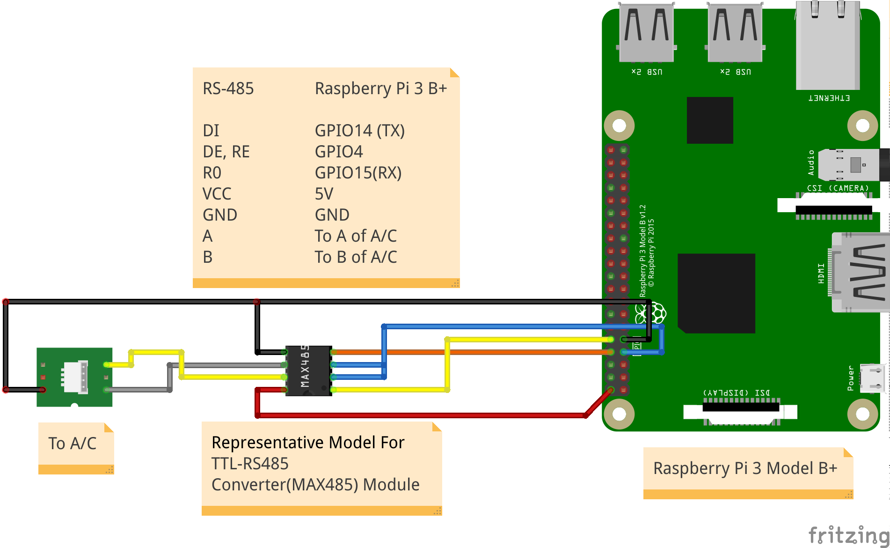

## Controller Unit
TODO: write a brief description (input, output, function of the subsystem, deployment method, etc...)

### Description
In this part of the project:

	* Data will be taken from air conditioner (Airwell) and sensors(A-star sensors)
	* The read data will be saved to the database
	* Air conditioning settings will be set according to the data from the web application

### Components used
	* Raspberry pi 3 B +
	* MAX485 TTL To RS485 Module
	* A-Star Sensors
	* Sparkfun ESP32 Thing
  
### Circuit Connection between MAX485 and Raspberry Pi 3 B+

### Inputs and outputs
>	**Inputs**
>
>		1. A/C
>			* Mode (Cool/Fan/Dry/Heat/Auto)
>			* Fan Speed (Low/Medium/High/Auto)
>			* A/C Degree (16°C ~ 30°C || 60°F ~ 85°F)
>			* A/C Zone (or A/C ID)
>			* ON/OFF
>
>		2. A-Star Sensor
>			* Degree
>			* Humidity
>			* Sensor ID

>	**Outputs**
>
>		1. To A/C
>			* Mode
>			* Fan Speed
>			* A/C Degree
>			* A/C Zone (or A/C ID)
>			* ON/OFF
>
>		2. To Database
>			* A/C Data
>			* A-Star Data
