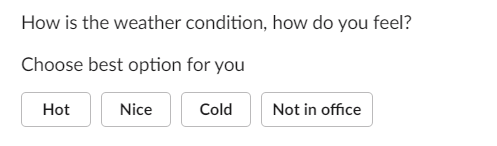
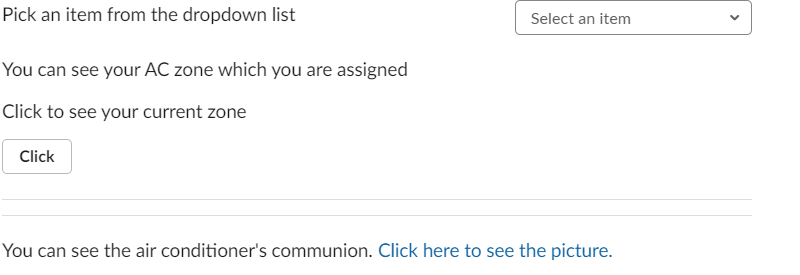

# Feedback Collector

**Description**

Feedback collector part of project handles collecting feedbacks from employees with Slack App. This slack app collects feedbacks by sending a direct message every user signed in to slack team. This direct message asks users how they feel the air condition and message contains three buttons(hot, good, cold) for interaction with users. This message can be driven by controller logic part of project. Rule-based model will decide when to send message to users and ask them how they feel. Most of the time controller logic send this message when average change of temperature reach significant amount. This message can be send manually and also can be scheduled by admin. Also information of which employee is affected by which air conditioner is gathered with another message. This message asks the users their location in office did changed. If changed then user chooses new air conditioner that affects him/her. There are several slash commands for making usage of slack app operations
easier. Slack app can be installed to any slack team easily. User feedbacks will be recorded after collect them.

**Installation of App**

You can install slack app by clicking below button. After that choose the channel that app will be installed.
(Database connection must be already exist before app installation. Slack access token will be stored in database after installation.)

**Input Parameters**

  - Postgresql Database Connection Infos
  
**Output Parameters**

  - Slack Air Condition Survey
  - Slack Location of Employee Survey
  - Slack Meeting Survey
  - Slack Username
  - Slack UserID
  - Channel ID
  - Selected Answer
  - Timestamp of Selection
  - Survey ID

**Sending Message**

App takes Slack token for reaching API. With this token app can call APIs that has permission from slack app. Our app uses chat.postmessage api for sending message and users.list for gathering every singed in user's userid. App uses these userids for sending them direct messages with chat.postmessage api. Message is created in json format. Slack app sends every info about user's action with request to python app for interactivity. User interactions from slack channel will be sent to python flask app. Flask app process those data and responds to slack. Meanwhile app also records data to database 

**Air Condition Survey**

This survey asks users how they feel the current weather condition. There are three options to answer. When user clicks any of options, chosed button, user informations and timestamp will be recorded to database. Rule based model will drive this survey and send it to users when it needed. Also users can send this survey manually or scheduled by hours.

**Location Survey**

In office air conditioner effects different areas. More air conditioner means more area will be effected. We need to record which user is effected by which air conditioner. This survey contains image link, a button and a dropdown menu to let users choose which location they are belong to. The image link shows the location of the air conditioners. The button indicates the current position. Like so when air conditon survey sent users answers will be rocorded according to their location.

**Meeting Survey**

On the days and times you want to use the meeting room, we have created a structure to check if the meeting room is already full or to reserve that room in advance. This command consists of a datepicker and two dropdown menus. First, you select the day of the meeting from the datepicker. Showing which meeting room is full on the day you selected. The meeting room is then selected from the menu. Finally, we select the desired time interval for the meeting. If we choose a previously booked meeting room, it says that the room is full and we should call the '/ meeting' command to make a selection again.

**Slash Commands**

There are several slash commands to allow users control the slack app. Slack app functionalities are accessable via these slash commands

- /hot /cold

This commands for let users notify the Model when there is something unordinary situation about air condition. Users type /hot when they feel hot and /cold for feel cold. When three user in same location uses same command model will be notifed. These three command must be sent in a hour. Every hour database resets old slash commands.

- /sendsurvey

This command send air condition survey to all users.

- /onsurveyschedule

This command stars schedule for sending air condition survey to all users. Schedule will be set survey by minute. Time interval must be written beside the command. /onsurveyschedule 15 will be set schedule with 15 minute interval.

- /offsurveyschedule

This command stops schedule of air condition survey.

- /location

When user types this command location survey will be sent to only that user. This command is for when there is change in any user location.

- /locationall

This command sends location survey to all user.

- /onlocationschedule

This command stars schedule for sending location survey to all users. Schedule will be set survey by minute. Time interval must be written beside the command. /onsurveyschedule 15 will be set schedule with 15 minute interval.

- /offlocationschedule

This command stops schedule of location survey.

- /snoozeon

This command was created for users who do not want to receive a location and air conditioning survey. Users can block surveys at any time using this command.

- /snoozeoff

Users can use this command to get air condition and location surveys at any time.

- /meeting

This command sends meeting survey to all user.

**Deployment**

Python app deployed to Heroku server. 

